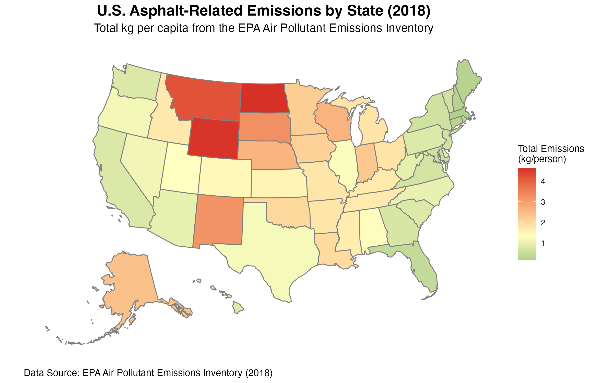

# Asphalt Emissions Choropleth Map (2018)

## Project Overview

This project creates a U.S. states choropleth map visualization of asphalt-related emissions data from the EPA's Air Pollutant Emissions Inventory (2018). The map uses a vivid color gradient—dark green for low emissions, yellow for medium, and red for high—to show emissions intensity by state.

## Map Visualization



*Interactive version: Open the PNG file directly in the `plots/` folder.*

## Data Source

**Research Paper:**
> Anthropogenic secondary organic aerosol and ozone production from asphalt-related emissions, *Environ. Sci.: Atmos.*, 2023, 3, 1221-1230

**DOI:** https://doi.org/10.1039/D3EA00066D

**EPA Data:**
- Source: U.S. Environmental Protection Agency (EPA)
- File: AP_2018_State_County_Inventory.xlsx
- Download URL: https://pasteur.epa.gov/uploads/10.23719/1531683/AP_2018_State_County_Inventory.xlsx
- Sheet Used: "Output - State"
- Metrics: State name, Total kg/person emissions

## How to Use This Project

### Quick Start
```bash
# Run the script to generate the map
Rscript asphalt_emissions.R
```

### Prerequisites
- R 4.0+
- Required packages (automatically installed if using `pacman::p_load()`):
  - `readxl` - Read Excel files
  - `tidyverse` - Data manipulation
  - `usmap` - U.S. map data
  - `sf` - Spatial features
  - `ggplot2` - Visualization
  - `here` - Cross-platform file paths

### What the Script Does
1. Creates `data/` and `plots/` directories
2. Downloads EPA data (if not already present)
3. Reads emissions data from the "Output - State" sheet
4. Merges emissions data with U.S. state boundaries
5. Generates a choropleth map with:
   - Color scale: dark green (low) → yellow (medium) → red (high)
   - Grey state borders
   - Title with "(2018)" year reference
   - Descriptive subtitle and EPA data source caption
   - No axis labels (typical for choropleth maps)
6. Saves the map as a high-resolution PNG file

### Output Files
- **`plots/asphalt_emissions_2018.png`** - Publication-ready choropleth map (14"×8", 300 DPI)
- **`data/AP_2018_State_County_Inventory.xlsx`** - EPA source data (downloaded if missing)

## Project Structure

```
asphalt_emissions_2018_qwen3_8b/
├── README.md                                    # This file
├── plan.md                                      # Implementation strategy
├── tasks.md                                     # Task checklist
├── walkthrough.md                              # Step-by-step guide
├── asphalt_emissions.R                         # Main R script
├── .gitignore                                  # Git ignore rules
├── prompt.md                                   # Original coding prompt
├── data/
│   └── AP_2018_State_County_Inventory.xlsx     # EPA source data (auto-downloaded)
└── plots/
    └── asphalt_emissions_2018.png              # Output choropleth map
```

## Key Features

### Data Handling
- ✓ Automatic EPA data download (binary mode)
- ✓ Conditional download—skips if file already exists
- ✓ Quiet Excel reading with `.name_repair = "unique_quiet"`
- ✓ State name normalization (lowercase matching)
- ✓ Warning suppression for numeric conversions
- ✓ Data validation and merge reporting

### Map Visualization
- ✓ All 50 U.S. states plus D.C.
- ✓ Alaska and Hawaii included
- ✓ Vivid three-color gradient (green → yellow → red)
- ✓ Median-centered color scale for balanced distribution
- ✓ Grey state borders with appropriate linewidth
- ✓ White background
- ✓ Professional title, subtitle, and caption
- ✓ No axis labels or ticks

### Code Quality
- ✓ Cross-platform path handling with `here::here()`
- ✓ Package management with `pacman::p_load()`
- ✓ Comprehensive error handling
- ✓ Informative console output with status indicators
- ✓ Well-documented with inline comments
- ✓ Reproducible and tested

## Technical Notes

### Color Scale
The gradient is centered at the **median** emission value rather than the mean. This provides better visual balance when the data has outliers.

- **Dark Green** (#1b7837): Low emissions (below median)
- **Yellow** (#ffffbf): Median emissions
- **Red** (#d73027): High emissions (above median)

### State Name Matching
States are matched between the EPA data and map data using lowercase normalization:
```r
state_lower = tolower(state_name)
```
This ensures consistent merging regardless of capitalization differences.

### Map Data Format
The script handles the sf (Simple Features) object format returned by `usmap::us_map()` in version 0.7.0 and later, which includes a `geom` column containing geometry data.

## Troubleshooting

### Download Issues
If the EPA URL fails, you can manually download the file and place it at:
```
data/AP_2018_State_County_Inventory.xlsx
```

### Missing Packages
The script uses `pacman::p_load()` which automatically installs missing packages. If you encounter issues:
```r
# Manual installation
install.packages(c("readxl", "tidyverse", "usmap", "sf", "ggplot2", "here"))
```

### Map Not Displaying Properly
- Verify the Excel file was downloaded correctly
- Check that the "Output - State" sheet exists
- Ensure state names in the data match the expected format

## Related Documentation

- [Implementation Plan](plan.md) - High-level strategy for the project
- [Task Checklist](tasks.md) - Detailed checklist of all implementation tasks
- [Step-by-Step Walkthrough](walkthrough.md) - Deep dive into how the script works
- [Original Prompt](prompt.md) - Complete project requirements

## License & Attribution

This project implements the requirements specified in the coding prompt. The visualization uses EPA data, which is in the public domain.

**Please cite:**
- EPA Air Pollutant Emissions Inventory (2018)
- Research paper: https://doi.org/10.1039/D3EA00066D

## Questions & Support

For issues or questions:
1. Check the [Step-by-Step Walkthrough](walkthrough.md)
2. Review the [Task Checklist](tasks.md)
3. Verify R version and package installations
4. Run the script line-by-line in RStudio for debugging

---

*Last updated: January 2026*
